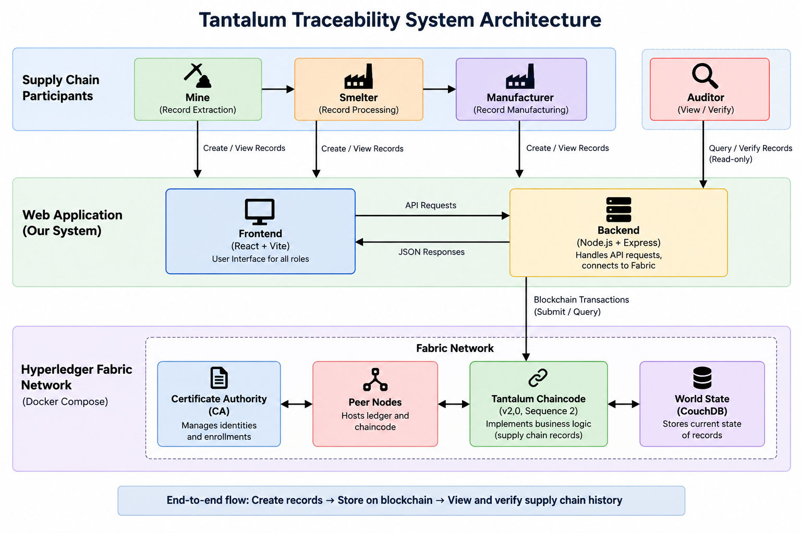

# Blockchain-Based Chain-of-Custody Verification System for Tantalum Traceability

A Hyperledger Fabric-based system for maintaining a tamper-evident and auditable chain of custody for Tantalum batches across the mineral supply chain.

> **Note:** All data used in this project is synthetic/simulated.

## Problem

Mineral supply chains involve multiple participants, making it difficult to maintain a transparent and verifiable record of material movement and transformation.

This project provides a permissioned blockchain-based approach to record batch creation, merging, splitting, risk flags, and manufacturer receipt while preserving the lineage of each batch.

## Objectives

- Maintain a tamper-evident chain of custody.
- Track batch lineage across Mine → Smelter → Manufacturer.
- Support merge and split operations using parent-child relationships.
- Record auditor risk/contamination flags.
- Calculate contamination risk based on weighted material contributions.
- Enforce role-based access control.

## System Architecture



## Supply Chain Workflow

```text
Mine → Smelter → Manufacturer
             ↑
          Auditor
       (verification)


## Fabric Network

The project uses a Hyperledger Fabric permissioned network based on the Fabric test-network.

### Network Components

```text
                    Hyperledger Fabric Network
                           mychannel
                              │
              ┌───────────────┴───────────────┐
              │                               │
           Org1MSP                         Org2MSP
              │                               │
       ┌──────┴──────┐                 ┌──────┴──────┐
       │             │                 │             │
   Peer0 Org1     CA Org1          Peer0 Org2     CA Org2
       │                               │
       └───────────────┬───────────────┘
                       │
                 Orderer Service
                       │
                   Orderer CA